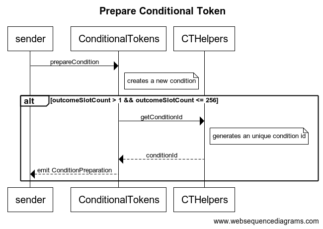
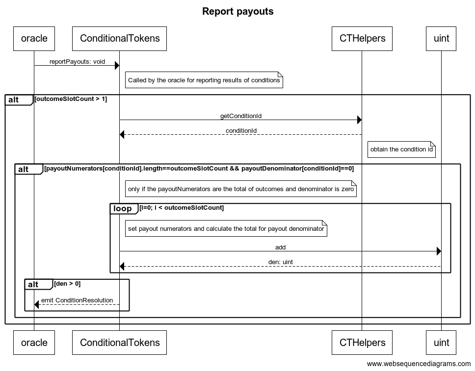
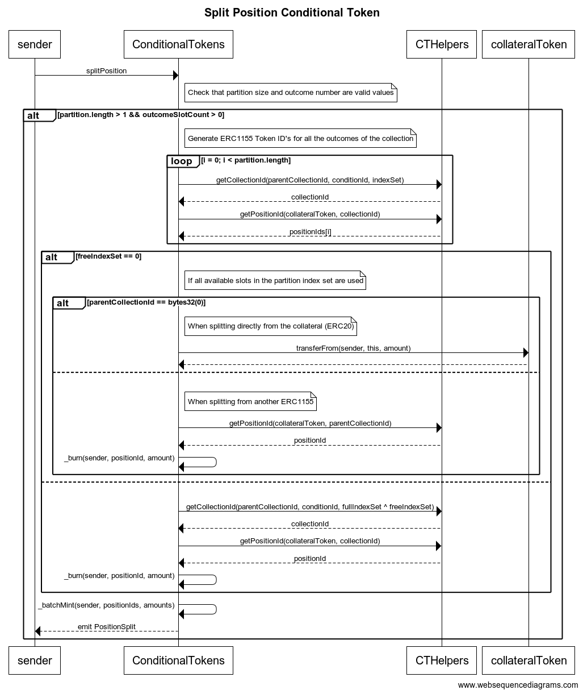

Conditional Tokens Explorer Doc
===============================

# UML Class Diagram


# UML Sequence Diagrams

## Prepare condition


```
title Prepare Conditional Token

sender->ConditionalTokens: prepareCondition
note right of ConditionalTokens: creates a new condition
alt outcomeSlotCount > 1 && outcomeSlotCount <= 256
ConditionalTokens->CTHelpers: getConditionId
note right of CTHelpers: generates an unique condition id
CTHelpers-->ConditionalTokens: conditionId

ConditionalTokens-->sender: emit ConditionPreparation
```

## Report payouts



```
title Report payouts

oracle->ConditionalTokens: reportPayouts: void
note right of ConditionalTokens: Called by the oracle for reporting results of conditions
alt outcomeSlotCount > 1
ConditionalTokens->CTHelpers: getConditionId
CTHelpers-->ConditionalTokens: conditionId
note right of CTHelpers: obtain the condition id
alt payoutNumerators[conditionId].length==outcomeSlotCount && payoutDenominator[conditionId]==0

note right of ConditionalTokens: only if the payoutNumerators are the total of outcomes and denominator is zero

loop i=0; i < outcomeSlotCount
note right of ConditionalTokens: set payout numerators and calculate the total for payout denominator
ConditionalTokens->uint: add
uint-->ConditionalTokens: den: uint
end

alt den > 0
ConditionalTokens-->oracle: emit ConditionResolution
```

## Split Position



```
title Split Position Conditional Token


sender->ConditionalTokens: splitPosition
note right of ConditionalTokens: Check that partition size and outcome number are valid values
alt partition.length > 1 && outcomeSlotCount > 0
note right of ConditionalTokens: Generate ERC1155 Token ID's for all the outcomes of the collection
loop i = 0; i < partition.length
ConditionalTokens->CTHelpers: getCollectionId(parentCollectionId, conditionId, indexSet)
CTHelpers-->ConditionalTokens: collectionId
ConditionalTokens->CTHelpers: getPositionId(collateralToken, collectionId)
CTHelpers-->ConditionalTokens: positionIds[i]
end

alt freeIndexSet == 0
note right of ConditionalTokens: If all available slots in the partition index set are used

alt parentCollectionId == bytes32(0)
note right of ConditionalTokens: When splitting directly from the collateral (ERC20)
ConditionalTokens->collateralToken:transferFrom(sender, this, amount)
collateralToken-->ConditionalTokens:
else
note right of ConditionalTokens: When splitting from another ERC1155
ConditionalTokens->CTHelpers:getPositionId(collateralToken, parentCollectionId)
CTHelpers-->ConditionalTokens: positionId
ConditionalTokens->ConditionalTokens: _burn(sender, positionId, amount)
end

else
ConditionalTokens->CTHelpers:getCollectionId(parentCollectionId, conditionId, fullIndexSet ^ freeIndexSet)
CTHelpers-->ConditionalTokens:collectionId
ConditionalTokens->CTHelpers:getPositionId(collateralToken, collectionId)
CTHelpers-->ConditionalTokens: positionId
ConditionalTokens->ConditionalTokens: _burn(sender, positionId, amount)

end

ConditionalTokens->ConditionalTokens:_batchMint(sender, positionIds, amounts)

ConditionalTokens-->sender: emit PositionSplit
```